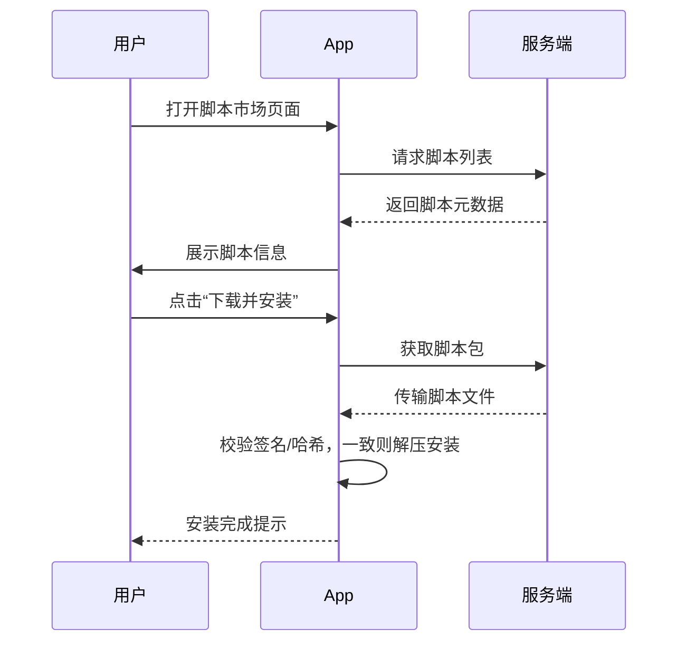

# 执行摘要

移动端开源脚本聚合 App 的核心是构建一个脚本宿主环境，使用户能编写和安装脚本来控制整个原生界面与系统功能。系统需要提供高性能的脚本运行时和完整的原生 UI 组件库，使脚本能创建按钮、列表、文本等控件并响应交互，同时严格隔离脚本执行避免安全风险。架构上，App 一方面集成脚本引擎（如 JavaScript、Lua、Python），一方面暴露原生 API 供脚本调用，类似阿里 LuaView 的设计【10†L37-L45】。脚本通过桥接层调用系统功能（网络、存储、传感器等），并在宿主 App 进程中运行。需要设计脚本沙箱和权限体系，防止恶意脚本访问敏感权限或滥用资源【34†L54-L60】【46†L1-L3】。同时还要支持脚本的安装、签名验证、热更新和在线市场（可选后端架构）。执行中参考现有项目，例如 iOS 的 Scriptable 允许 JS 调用原生 API 并呈现原生 Alert【14†L39-L43】，Android 的 Auto.js 则用 Rhino 引擎支持 E4X UI 定义和脚本打包【18†L399-L407】。整体方案需兼顾跨平台开发成本、性能和安全合规。  

## 架构设计

App 架构分为**原生宿主层**和**脚本运行层**两大部分。宿主层包括原生 UI 框架、权限管理模块和脚本安装/更新模块；脚本运行层包括嵌入的脚本引擎（JavaScript、Lua 或 Python）及其沙箱环境。其核心架构可表示为：  

```mermaid
graph LR
    subgraph 应用本体
      UI[原生 UI 组件库] --> Bridge[脚本桥接接口]
      Bridge --> SE[脚本运行时引擎]
      SE --> Bridge
      Bridge --> Sys[系统功能库（网络、存储、传感器等）]
      SE --> Sys
    end
    subgraph 后端服务（可选）
      Remote[脚本市场/仓库服务器]
      Remote -->|脚本下载| 应用本体
    end
```

- **原生 UI 组件库**：宿主 App 内置常用原生控件，例如按钮(Button)、标签(Label)、列表(ListView/TableView)、文本输入框、滑动视图等。脚本可通过桥接接口创建并操作这些组件【10†L37-L45】【20†L13-L21】。组件库还包括布局管理和常见交互控件（开关、滑块、日期选择器等）。  
- **桥接接口层**：将脚本层调用映射到对应的原生功能，包括 UI 创建、系统服务（如 HTTP 网络、文件存取、音频视频）和平台 API（GPS、摄像头、蓝牙等）。参考 LuaView 的实现，其核心库分为 UI Lib 和 Non-UI Lib【10†L37-L45】，为脚本提供一致接口。  
- **脚本运行时引擎**：在 App 进程内部嵌入一到多个脚本语言引擎（如 JavaScriptCore/V8、Lua 解释器、Python 解释器）。引擎运行在隔离环境中，只暴露经桥接接口允许的功能。不同引擎间互相独立，并可动态加载用户脚本。  
- **系统功能库**：封装操作系统功能，供脚本调用，如发起网络请求、读写存储、访问设备传感器等。与桥接层一起构成脚本可调用的外部功能集。  
- **脚本管理模块**：负责脚本安装、更新、签名校验、存储管理。可选地，如果使用后端，还需实现脚本市场服务（脚本发布、版本管理、下载统计等）。  

不同方案对架构影响较大：**无后端**时，脚本只能本地导入/同步更新；**有后端**时，需设计安全的脚本分发和版本控制系统。此外，App 要遵循平台安全规范，例如 iOS 禁止在运行时下载执行未经审核的代码【34†L54-L60】。  

## 关键技术选型

针对 Android/iOS 两端开发以及脚本执行环境的技术选型，需要综合考虑跨平台能力、性能、生态成熟度等。主要方案包括：  

| 技术栈 | 优点 | 缺点 | 适用场景 | 成熟度/生态 |
| :- | :- | :- | :- | :- |
| **原生开发** (Android: Kotlin/Java；iOS: Swift/ObjC) | 性能最好，直接访问原生 API；UI和系统接口控制灵活。安全性高，与平台最新特性同步。 | 代码量大，Android和iOS需分别实现；跨端逻辑难共享。 | 对性能和原生 UI 体验要求极高的项目。 | 官方支持，生态成熟度最高。 |
| **Flutter (Dart)** | 性能接近原生【26†L90-L98】；采用 Skia 绘制，UI 流畅、跨端一致；热重载效率高。 | 需要学习 Dart 语言；UI 绘制非原生控件，应用体积大；调用原生功能需编写桥接层。 | 希望快速构建高性能跨端 UI，接受非原生控件绘制场景。 | Google 支持，社区增长快；Flutter 生态活跃。 |
| **React Native (JavaScript)** | 使用 JavaScript/React 生态；原生视图渲染，跨平台共享业务逻辑；社区庞大【26†L110-L118】。 | JSBridge 通信带来性能开销【26†L94-L100】；需维护原生模块；框架升级可能影响兼容性。 | 团队熟悉 JS/React，追求较快开发效率和跨平台。 | Facebook 支持，长期成熟；第三方库丰富。 |
| **Kotlin 多平台 (KMM/KMP)** | 共享核心业务逻辑（网络、数据库等），但 UI 仍需原生编写；可使用 Kotlin Multiplatform Mobile 实现跨端代码复用。 | UI 需各端原生代码；生态尚在成长中。 | 重视代码一致性，愿意为共享逻辑投入精力，UI差异可接受。 | JetBrains 主推，生态持续完善中。 |
| **Weex/Vue 等前端跨端框架** | 使用 Web 开发模式（Vue.js/Rax）构建原生界面。【31†L112-L121】 Weex 可动态渲染原生组件。 | 社区活跃度低于 Flutter/RN；依赖特定前端框架；生态较小。 | 业务已有丰富 Web 经验，需较灵活 UI 动态化。 | Apache Weex 项目开源，但活跃度有限。 |

在脚本语言和运行时方面，需要选型脚本引擎：  
- **JavaScript 引擎**：iOS 可用内置 `JavaScriptCore` (Safari 内核)，Android 可选 V8（如 J2V8 封装）或 Rhino。【37†L73-L82】【37†L96-L104】。JavaScript 生态丰富，语法广泛应用，但引擎体积相对较大。  
- **Lua 解释器**：轻量级、启动快，易于嵌入。推荐使用官方 Lua C 库（或 LuaJ）在两端集成。Lua语法简单，扩展性强，脚本体积小。适合性能敏感、需要嵌入式脚本的场景。  
- **Python 解释器**：功能强大、库丰富，但嵌入代价大。Android 可使用 Chaquopy、SL4A 等；iOS 有 PythonKit/pyto 等方案。缺点是运行时重，iOS 上需符合 App Store 策略（脚本不可下载）。通常仅作为可选高级语言支持。  

各方案成熟度和社区：Flutter/ReactNative 文档丰富【26†L109-L118】；原生框架稳定；KMM 正快速成长；脚本引擎方面，V8/J2V8 和 Rhino 均为开源项目【37†L73-L82】【37†L96-L104】。Flutter 编译输出直接本地代码【26†L90-L98】，ReactNative 需 JSBridge 通信【26†L94-L100】；原生无跨端共享。总体选型应根据团队技术栈和业务需求权衡，以**原生开发结合脚本引擎**的方案为主，或在此基础上考虑跨平台框架辅助 UI 渲染。

## 脚本运行时与沙箱实现

脚本运行时需提供安全隔离的执行环境，防止未经授权的系统访问。常见实现思路是：在宿主 App 进程内创建独立的脚本上下文，对外只暴露经过许可的 API。在该沙箱环境中，脚本只能操作由桥接接口提供的组件和系统功能，其它系统资源一律禁止访问。具体措施包括：  

- **隔离脚本上下文**：每个脚本运行在独立线程或虚拟机上下文中，拥有自己的全局对象。对 iOS 来说，可使用 JavaScriptCore 的 JSContext 或 Lua 的 Lua State；Android 上可用 J2V8 或 Rhino 等【37†L73-L82】。  
- **限制内建库**：剥离脚本语言原生库（如 `os`、`io`、`fs`）访问，仅保留沙箱安全的子集。API 调用通过宿主控制的桥接层进行。例如，不直接开放文件系统操作，而是提供受控的存储接口。  
- **运行时监控**：实时监控脚本运行状态，防止无限循环或过度占用资源。可通过设置执行超时、内存限额，当超出时中断脚本并报告错误。脚本引擎的垃圾回收与手动释放机制也要合理配置（例如 J2V8 提供 `release()` 方法释放本地对象句柄【37†L73-L82】）。  
- **权限校验**：脚本调用敏感 API（如访问位置、通讯录）时，需弹出用户确认或先在脚本元数据中声明权限。宿主层应对危险权限调用进行二次检查，不允许脚本直接提权。  
- **代码签名与校验**：所有脚本包在分发前须进行数字签名或校验哈希，以避免被篡改。下载或导入脚本时，首先验证签名合法性，不通过则拒绝加载。脚本市场可设置审核机制，对脚本行为进行审查。  
- **遵守平台安全策略**：注意 iOS 对动态代码的限制【34†L54-L60】。可参考 Scriptable，脚本以文本形式存在沙箱中【13†L19-L27】，并仅执行已获授权的功能。Android 自身应用沙箱机制确保脚本无法脱离宿主权限【46†L1-L3】。  

脚本沙箱综合上述手段，实现与宿主隔离但又不损失功能灵活性。必要时，可考虑将脚本运行时部署在服务端（即云端运行）以进一步隔离风险，但这需要在线环境和额外后端逻辑支撑。

## 原生 UI 暴露 API 设计

需要为脚本语言设计一套易用的原生 UI 构建和事件处理 API，使其能够动态创建、布局和交互原生组件。主要思路是提供与主流 UI 框架相似的抽象，同时对脚本友好。关键点包括：  

- **组件列表**：提供常用的 UI 控件，如 `View`(容器)、`Button`(按钮)、`Label/Text`(文本)、`ImageView`(图片)、`TextField`(输入框)、`ListView/TableView`(列表)、`ScrollView`(可滚动容器)、`Slider`(滑块)、`Switch`(开关)、`DatePicker`(日期选择)、`WebView`（如需嵌入网页）、`MapView` 等【10†L37-L45】【20†L13-L21】。每种组件对应脚本中的类或构造函数，脚本可创建并添加到父容器中。组件属性包括位置、大小、样式、文本等。  

- **事件模型**：组件暴露标准事件，如点击(`onTap`)、长按(`onLongPress`)、值改变(`onChange`)、滑动等。脚本注册回调函数处理事件。例如，在 Pythonista 的 `ui` 模块中，可以通过 `button.action = 回调函数` 绑定按钮点击【20†L73-L81】；类似地，脚本可以写 `button.onTap = function() { ... }` 或 `function button:onTap() ... end` 来响应事件。事件回调中通常会传入事件对象或组件自身供进一步操作。  

- **数据绑定**：可选地提供双向数据绑定或观察者模式，方便脚本更新模型时自动刷新 UI。简易版可通过观察变量改变来更新组件属性，或提供内置绑定函数。设计时应与脚本语言特性兼容（如 Lua 可用元表，JS 可用 Proxy 等）。  

- **布局管理**：支持相对布局、绝对布局或弹性布局系统。脚本可通过设置 `flex`、`margin`、`align` 等属性来控制布局。也可以采用声明式布局语法，例如 JSON 描述或嵌套创建 View 层次。LuaView、React Native 等框架参考了类似 Flexbox 布局。  

- **样式与主题**：提供基础样式API（颜色、字体、对齐）。若有必要，可引入 CSS 样式或样式表文件让脚本重用样式。  

- **示例代码**：以下示例展示了如何使用上述 API 创建按钮并处理点击事件：  

```kotlin
// Android (Kotlin 伪代码)
val button = Button(context).apply {
    text = "点击我"
    setOnClickListener {
        println("按钮被点击")
    }
}
rootView.addView(button)
```  

```swift
// iOS (Swift 伪代码)
let button = UIButton(type: .system)
button.setTitle("点击我", for: .normal)
button.addTarget(self, action: #selector(buttonTapped), for: .touchUpInside)
view.addSubview(button)
```  

```js
// JavaScript 脚本示例
let button = new Button("点击我")
button.onTap = function() {
    console.log("按钮被点击")
}
UI.addView(button)
```  

```lua
-- Lua 脚本示例
local button = Button("点击我")
function button:onTap()
    print("按钮被点击")
end
mainView:addSubview(button)
```  

```python
# Python 脚本示例
button = Button("点击我")
button.on_tap = lambda: print("按钮被点击")
main_view.add_subview(button)
```  

以上示例与 Pythonista 的用法类似【20†L73-L81】。通过这些 API，脚本可以动态构建复杂界面，并响应用户操作。组件的具体接口（属性名称、事件回调参数等）应在设计文档中详细列出，确保跨语言和跨平台的一致性。

## 权限与安全模型

脚本执行过程中必须严格遵守平台权限模型与安全策略：

- **系统权限管理**：在 Android 和 iOS 上，应用获取危险权限（如摄像头、定位、通讯录等）需要用户授权。在设计时，为脚本调用敏感功能的接口添加权限申请流程。例如，脚本请求访问位置时，宿主 App 弹出系统许可对话框；若用户拒绝，则禁止该脚本功能。同一权限控制原则也应适用于脚本模块。  
- **脚本权限声明**：类似 Android 应用的 Manifest，可让脚本在元数据中声明其需要的权限。安装或执行脚本前，App 检查这些声明并在运行时提示用户。这样用户能在使用前了解脚本权限需求。  
- **平台沙箱隔离**：Android 平台为每个应用分配独立 Linux 用户身份，实现文件和资源隔离【46†L1-L3】。脚本作为宿主应用的一部分，自然处于该沙箱内，无法脱离宿主权限访问系统。iOS 通过进程沙箱限制应用的访问范围。两端都无法跨App访问其他应用私有数据。  
- **安全威胁模型**：常见威胁包括：脚本恶意窃取敏感信息、滥用权限进行恶意操作、消耗过多资源导致拒绝服务、下载时被篡改脚本包引入后门等。应针对这些威胁设计防护措施（见下表）。例如，苹果 App Store 明确禁止应用下载或执行改变功能的代码【34†L54-L60】，须确保符合该政策。  

以下为主要安全威胁及缓解措施示例：

| 威胁                              | 风险/影响                                       | 缓解措施                                                |
| :-------------------------------- | :--------------------------------------------- | :------------------------------------------------------ |
| 恶意脚本执行                      | 泄露用户隐私(位置、联系人等)、滥用权限           | 强制签名验证、脚本审核/沙箱运行；敏感操作弹窗提示        |
| 权限滥用                          | 自动发送短信/扣费、监听麦克风摄像头等            | 脚本权限声明；调用敏感API前二次提示；按需隔离权限       |
| 资源滥用 (CPU/内存/电量)         | 手机卡顿、耗电加剧、系统不稳定                   | 运行时监控 (时间片、内存限制)；脚本无限循环中断；后台降级 |
| 脚本逃逸 (访问宿主以外资源)     | 绕过沙箱访问文件系统或网络                        | 全面限制 API 接口，仅允许桥接层提供的功能；禁止动态加载本地代码 |
| 更新链路攻击 (中间人篡改脚本包)  | 恶意代码注入、后门程序                             | 使用 HTTPS + 代码签名；版本校验；强制验证签名或哈希     |
| 平台合规风险 (仅针对 iOS)        | 被拒绝上架；功能受限                              | 避免在运行时下载执行代码【34†L54-L60】；将脚本作为用户输入；提供源代码可见 |

所有敏感操作都应在宿主层进行控制。结合系统沙箱和上述权限机制，可最大程度保障用户安全。

## 脚本安装/更新/签名/验证流程

脚本包管理流程包括安装、升级、签名验证和存储。可分为**本地导入模式**和**在线市场模式**：

- **本地导入**：用户通过文件管理器或分享机制，将脚本文件导入 App（如通过「打开方式」选脚本文件）。App 接收到文件后，根据脚本包格式（如 zip 或单一脚本），先校验签名或哈希（若有配置），再解压/解析并存入本地仓库。解锁存储空间后，脚本可立即执行。此方式适用于无后端场景，完全由用户控制脚本来源。Scriptable 即将脚本存为普通 JS 文件【13†L19-L27】，可类比使用本地文件系统管理。  

- **在线市场**（需后端支持）：建立脚本仓库服务器，提供脚本上传审核、版本控制和下载服务。App 通过 RESTful 接口或 gRPC 与服务器交互。安装时，App 拉取脚本列表/元数据（含版本、签名、权限声明等），用户选择后 App 下载脚本包。【13†L19-L27】下载后，先使用内置公钥校验数字签名或校验哈希，确认包完整性和来源可信，然后再加载脚本。更新流程类似，通过版本对比判断是否有新版，用户确认后更新。下载过程建议使用 TLS 加密传输。  

- **签名与验证**：每个脚本包应由开发者或市场签名。可采用公钥基础设施，App 内置受信公钥用于验证。签名方案可以基于 X.509 证书或 HMAC。对于开放脚本市场，可引入评级和审核机制，对高权限脚本要求更严格的签署。  

- **安装 UI 流程示例**：  



对于无后端流程，类似用户将本地脚本“发送到”或“分享到”App 后执行上述校验和安装逻辑即可。  

## 调试与测试方案

为方便开发和运维，需要完善的调试与测试支持：  

- **脚本调试器**：集成脚本层级调试工具。可以参考 LuaView 提供的 LuaViewDebugger【10†L113-L122】，允许在 PC IDE（如 VS Code）中设置断点、单步执行、查看变量。JavaScript 环境可使用 Chrome 或 Safari 调试协议；Lua 可以嵌入远程调试库；Python 可使用 Python 自带调试工具。宿主 App 应能监听脚本调试端口或通过调试代理桥接到 IDE。  
- **日志输出**：脚本环境应捕捉标准输出和错误信息，并输出到宿主日志。提供 `console.log` 或类似函数将信息写入日志，方便定位问题。异常未捕获时，宿主应记录崩溃堆栈并提示脚本错误。  
- **模拟环境与单元测试**：提供虚拟化接口替代真实系统依赖，以便在模拟器或 CI 环境中运行脚本测试。例如，通过模拟网络请求、模拟传感器数据来验证脚本逻辑。编写脚本单元测试框架，使脚本开发者可以对逻辑进行自动化测试。  
- **集成测试**：在真实设备或模拟器上对脚本安装、热更新、权限弹窗等流程进行测试。对接 Crashlytics 或 Sentry 等工具收集运行时错误。  
- **示例脚本和文档**：为开发者提供丰富示例代码和最佳实践指南。例如，LuaView 在 GitHub 上整理了 API 文档和示例脚本【10†L113-L122】，可供学习。本系统应同样附带官方示例和教程。  

## 性能与内存管理

脚本执行效率和资源占用需要优化：  

- **引擎优化**：选择性能良好的脚本引擎。比如 J2V8 对 V8 引擎做了专门优化：采用“基本类型优先”策略、懒加载等降低开销【37†L73-L82】。可参考其设计，在本地对象不再使用时手动释放句柄。Lua 引擎本身很轻量，启动和 GC 开销小。注意对 JavaScript 引擎做热身或编译预热以加速脚本执行。  
- **缓存机制**：对频繁使用的脚本或组件可做缓存。脚本字节码或预编译可以缓存本地（减少每次解释成本）。UI 组件如列表视图可复用渲染，避免重复创建。  
- **异步执行**：脚本调用耗时操作时采用异步模式，避免 UI 线程阻塞。例如网络请求、图像加载等通过回调/Promise 模式处理。    
- **内存监控**：定期监测脚本层内存占用情况。宿主可在脚本长时间占用过多内存时进行回收或重启脚本环境。避免脚本泄露（如闭包长期持有大对象）。应用启动时检查空闲内存，必要时清理缓存。  
- **性能测试**：在真实业务场景下测试脚本运行的帧率和响应时间，确保交互流畅。针对热点代码进行优化，或把耗时逻辑移到原生模块中。  

## 打包与发布流程

- **应用打包**：Android 端按照 Google Play 要求生成签名 APK/AAB；iOS 端使用 Xcode 生成签名 IPA。App 内集成的脚本引擎、桥接库等需满足各平台兼容性（例如 Android NDK 构建、iOS bitcode）。如果采用跨平台框架（Flutter/RN），则使用其标准打包流程并嵌入脚本运行模块。  
- **脚本发布**：脚本本身作为内容发布，可以通过专用脚本市场分发（如服务器仓库），也可以通过第三方平台和渠道分享脚本文件（例如 GitHub、社区）。开发者可通过脚本市场后台上传、审核脚本，市场前端供用户浏览、评分、下载。脚本发布时应附带版本号、更新日志、作者信息及所需权限列表。  
- **热更新**：如果允许，脚本可以热更新。脚本市场下发新版本时，App 接收后更新本地缓存。必须严格按照签名校验新脚本正确性再替换。App 自身框架更新需走正常应用更新流程。  
- **测试版和灰度**：可以为脚本市场提供测试渠道，例如先供内部或付费用户试用新功能；App 可以设置灰度策略逐步推送重要更新。  

## 开发者 SDK/文档与示例

为支持开发者生态，应提供完整的 SDK、文档和示例：  

- **SDK/API 文档**：发布详细 API 参考，包括所有暴露给脚本的对象、方法、事件及参数说明。参考 LuaView 开源库提供的文档【10†L113-L122】，确保脚本开发者一目了然各接口用法。  
- **示例代码**：提供官方示例脚本（JavaScript、Lua、Python 版本），演示常见功能如界面布局、网络请求、文件读写和硬件调用。示例应覆盖各平台差异和最佳实践。  
- **开发工具支持**：如果可能，开发配套 IDE 插件或模板，如 VS Code 插件支持脚本代码高亮、调试。Documentations 可以离线使用或内置 App 浏览。  
- **社区与反馈**：搭建社区论坛或问题跟踪机制，收集开发者反馈和贡献脚本。发布更新路线图和常见问题解答，降低学习成本。  

## 迁移与兼容性策略

平台和框架版本迭代时须考虑兼容性：  

- **脚本引擎升级**：如果将引擎从旧版升级（如 Rhino 升级到新版，或 V8 升级），需要测试现有脚本的兼容性并提供兼容性层或转换工具。  
- **API 版本控制**：为脚本 API 设计版本号。新版本移除或修改接口时，保留旧版本 API 以支持已发布脚本，或提供升级脚本的向导。LuaView 强调“一次编写，两端运行”，因此努力保持脚本接口在 Android/iOS 间统一【10†L49-L57】，类似地我们应确保各平台接口尽量一致。  
- **系统兼容性**：设定最低支持的 Android/iOS 版本，并定期调整（例如不再支持已弃用的旧 API）。对于老设备上的脚本功能下降，可以通过兼容分支代码或提示升级系统来解决。  
- **迁移工具**：若 API 更新较大，可开发脚本兼容工具或转换脚本，例如自动将旧 API 调用替换为新 API。  

## 风险与替代方案

- **平台合规风险**：如前述，iOS 对动态代码下载执行要求严格【34†L54-L60】。若发布在 App Store 需确保脚本部分被视为“用户生成内容”或已在审核时包含源码。替代方案是在不违反规定的前提下，仅允许用户手动导入脚本而非自动下载。  
- **性能风险**：脚本执行时可能出现性能瓶颈，尤其在低端设备。若 JavaScript 引擎开销过大，可考虑仅支持 Lua 等更轻量语言，或在关键路径上使用原生插件替代脚本逻辑。  
- **安全风险**：脚本沙箱若出现漏洞，可能导致宿主系统被攻击。应定期审计脚本接口代码，及时修复高危漏洞。替代方案是将敏感逻辑尽量放在原生模块中，减少脚本可触及面。  
- **技术复杂度**：跨平台开发和多语言集成门槛高，可能导致开发成本增加。可权衡仅支持一种主流脚本语言（如只用 JS 或 Lua），减轻维护负担。  
- **无后端场景**：若不使用服务器，脚本市场和更新功能受限。替代方案是完全本地化：通过文件分享或 Git 同步脚本，并在 App 内构建脚本管理 UI，但缺少集中管理和推送能力。  

## 时间线建议

实施该项目可分阶段推进，下面为一个参考里程碑和估算人力：  

- **阶段1 (1-2月)：** 需求调研与架构设计。完成技术选型、环境搭建和原型验证（3人）。  
- **阶段2 (3-5月)：** 核心功能开发。实现脚本引擎集成、原生 UI 桥接、基本组件库和脚本沙箱（4人）。  
- **阶段3 (6月)：** 安全与权限。完善权限申请流程、沙箱限制及签名验证；同时若有后端需求则并行开发脚本市场接口（3人）。  
- **阶段4 (7月)：** 调试测试和性能优化。集成调试工具、编写示例脚本、执行全面测试和性能调优（2人）。  
- **阶段5 (8月)：** 文档和发布。完善开发者文档、示例代码，准备发布流程并上线（2人）。  

总计约需**6-8个月**，团队规模可灵活调整（5~7人交叉投入）。如无后端则可省去阶段3的服务器开发；若需要更复杂的脚本市场功能，则相应延长后端开发时间。


**主要参考资料：** 阿里 LuaView 跨平台动态化实践【10†L37-L45】【10†L49-L57】【10†L113-L122】；Scriptable 应用介绍【14†L39-L43】【13†L19-L27】；Auto.js 功能文档【18†L399-L407】；Pythonista UI 文档【20†L13-L21】【20†L73-L81】；React Native/Flutter 对比【26†L64-L73】【26†L90-L98】【26†L110-L118】；安卓应用沙箱【46†L1-L3】；Apple 动态代码政策【34†L54-L60】。